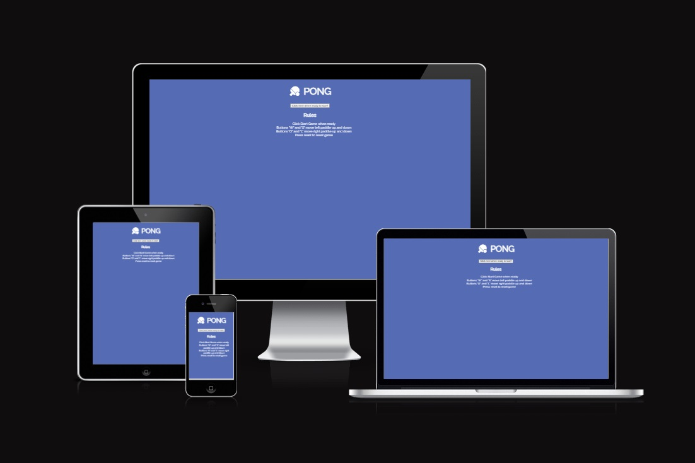
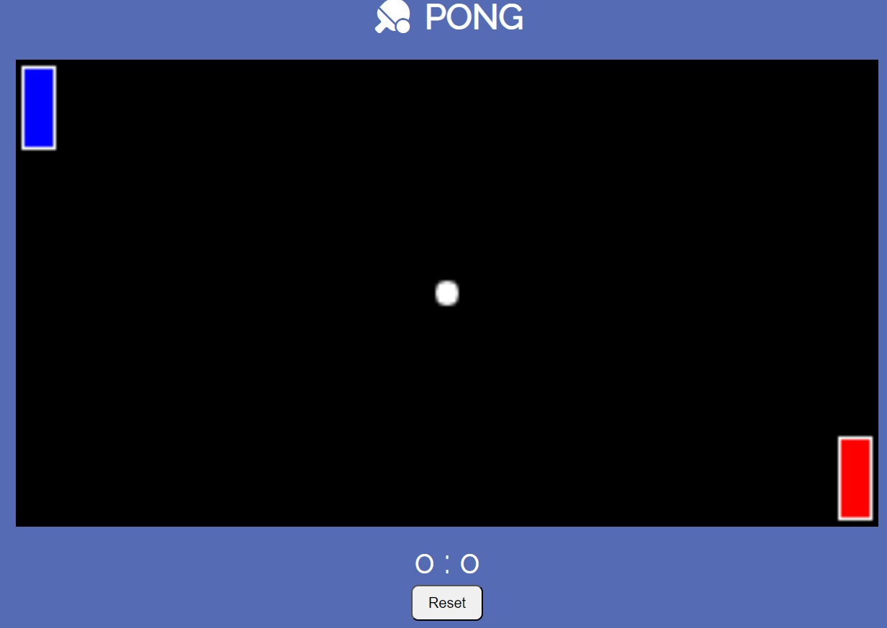
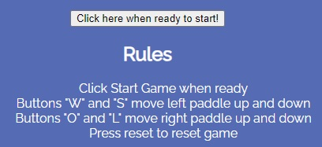
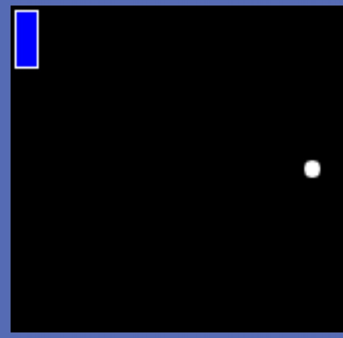
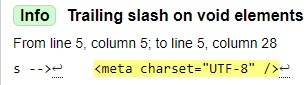
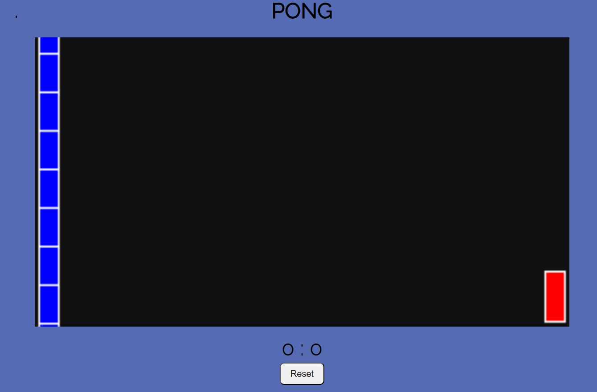
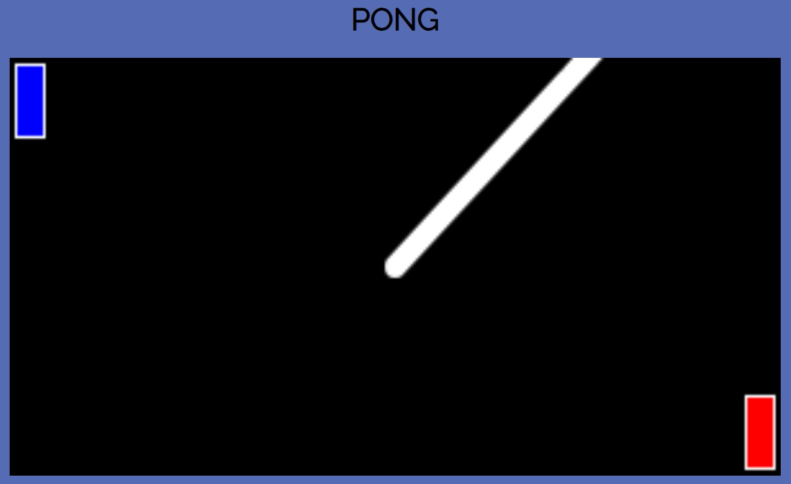
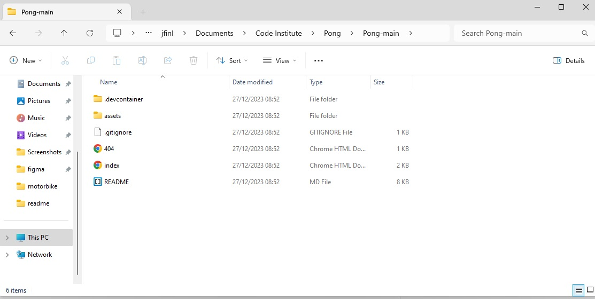

# UX

I've created a game of Pong.
Pong was created back in the 29th of November 1972.
This is my first Javascript project I've made and wanted to make Pong as a credit for my dad. We used to play it a lot when I was young and built our own Pong game years ago.
The game is simple but fun. 
I created it for users to jump in and out easily and solely to enjoy themself with this amazing classic game.
I kept the design simple with a basic background with no images to distract the user and keep them engaged with the game, aswell as keeping the original colors for the canvas and ball. I changed and updated the paddles for a more modern classic of red vs blue.
I created a "start menu" so the user isn't rushed into the game and can read the rules fairly before starting. Even when starting the game I've implemented a time delay for two and a half seconds before the ball starts moving to again not rush the user.
Theres a scoreboard to keep track of the score aswell as a reset button if the user would like to start from the top.

# Features

__Existing Features__

- A fully functioning and correctly working game of Pong.
- A basic background with no images to distract the user.
- A classic black canvas with a white ball - as a nod to the classic Atari Pong.

- A start menu before starting the game to give the user time to read the rules. I thought this would be a great way for the user not to be rushed into forcing playing the game without knowing the controls and would ultimately lead to a bad user experience. The game runs at the users pace and they're allowed to start when ready. 

 

- A timer delay after clicking start. For two and a half seconds when entering the game the ball is frozen and will not move - just to allow the user to brace themselves before beginning. 

 

- A more modern variation of red vs blue paddle design
such as; 
Blue paddle

Red paddle

- A scoreboard to keep track of score

- A reset button for users to start from the top

# Features Left to Implement

I have plenty of ideas I would love to add to this project such as;

- A difficulty selector (easy, medium, hard).
- A background selector. So the user can swap background or paddle colors to whatever they'd like.
- Add the ability for the user to change paddle sizes or ball sizes (for general fun).
- Add a pause to the reset button before the ball starts again.
- An AI/bot function for a single player game
- Lastly, I'd like to add a "challenge game" which introduces a "life" system. Where you have 3 lives and the ai/bot is set to extremely easy with 3 lives himself. When you score 3 times and beat the computer the background changes, the ball speed ever so slightly increases and the ai/bot gets smarter and predicts the ball better. There would be maybe 5 stages of ai opponents to beat to complete the challenge with the last stage being incredibly hard to score. You'd have three lives and if the computer takes them all the game stops and the user loses.

# Testing

I've tested my Pong game website on multiple browers such as Firefox/Chrome and Microsoft edge. As well as my android phone using "Samsung internet".
To my current knowledge there are no bugs on any device or internet browser - although I'm still yet to test fully on an ipad/tablet.
The website is fully adaptable to all devices and screen sizes.
I believe any of my website consumers will be happy and have a great experience and enjoy playing my game of Pong.

- Firefox
  - Mainpage - Works as intended
  - Eventspage - Works as intended
  - gallerypage - Works as intended
  - signup page - Works as intended

- Chrome
  - Mainpage - Works as intended
  - Eventspage - Works as intended
  - gallerypage - Works as intended
  - signup page - Works as intended

- Microsoft edge
  - Mainpage - Works as intended
  - Eventspage - Works as intended
  - gallerypage - Works as intended
  - signup page - Works as intended

## Mobile testing

- Firefox (mobile)
  - Mainpage - Works as intended
  - Eventspage - Works as intended
  - gallerypage - Works as intended
  - signup page - Works as intended

- Chrome (mobile)
  - Mainpage - Works as intended
  - Eventspage - Works as intended
  - gallerypage - Works as intended
  - signup page - Works as intended

- Microsoft edge (mobile)
  - Mainpage - Works as intended
  - Eventspage - Works as intended
  - gallerypage - Works as intended
  - signup page - Works as intended

# Validator Testing
- HTML
No errors were returned when passing through the official W3C validator -
<https://validator.w3.org/nu/?doc=https%3A%2F%2Fjordan-finlay.github.io%2FPong%2F>

- CSS
No errors were found when passing through the official (Jigsaw) validator - 
<https://jigsaw.w3.org/css-validator/validator?uri=https%3A%2F%2Fjordan-finlay.github.io%2FPong%2F&profile=css3svg&usermedium=all&warning=1&vextwarning=&lang=en>

- Lighthouse
No errors were found when using ligthouse -
<https://pagespeed.web.dev/analysis/https-jordan-finlay-github-io-Pong/zvka6wjtqb?form_factor=mobile>
<https://pagespeed.web.dev/analysis/https-jordan-finlay-github-io-Pong/zvka6wjtqb?form_factor=desktop>

I am currently using "Prettier" so the W3C validator complains with trailing slashes that have "no effect".
I can remove the slashes myself but whenever I save or format my code prettier will add them back in.

# Bugs
I've had quite a few bugs whilst creating the game.
Two major bugs I had (admittedly were hilarious but simultaneously infuriating) were;
- Firstly a bug when moving the paddle up/down would create a new paddle entirely. I found and fixed the bug and is now working correctly as intended.

- Secondly I had a similar bug with the ball. It would create multiple balls drawn in a line. I found and fixed this bug too and is now working correctly as intended.

# Wireframes

I used a website called 'figma' for wireframes - <https://www.figma.com/?fuid=>
I've uploaded my recent ones to googledrive -
<https://drive.google.com/drive/folders/1VqFUhoUlYytCUH0jZlufqn4eQa8gcfYy>

# Deployment

- The site was deployed to GitHub pages. The steps to deploy are as follows:
  - In the GitHub repository, navigate to the Settings tab
  - From the source section drop-down menu, select the Master Branch
  - Once the master branch has been selected, the page will be automatically refreshed with a detailed ribbon display to indicate the successful deployment.

The live link can be found here - <https://jordan-finlay.github.io/Pong/>

## Local deployment

- I've downloaded a copy of my Pong website/game onto my computer and am able to access it through local deployment to change and mess around with the layout and structure for better user experience.

# Credits

__Content__

- The icons in the footer were taken from [Font Awesome](https://fontawesome.com/)
- I got my fonts from Google fonts <https://fonts.google.com/>

__Media__

- I got my favicon from icons8.com <https://icons8.com/icons/set/pong>
- I got my wireframes from figma <https://www.figma.com/?fuid=>
